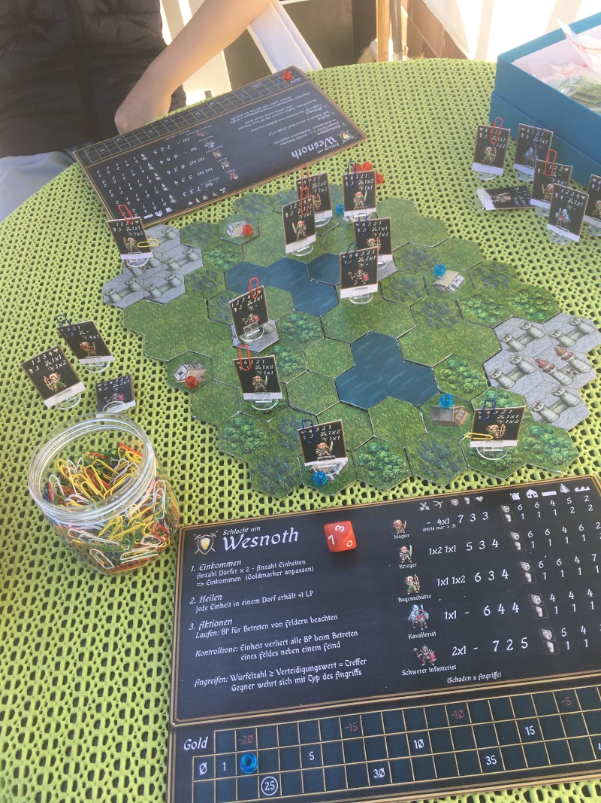

Die Schlacht um Wesnoth - Das Brettspiel
===================================

  
"Die Schlacht um Wesnoth" ist ein quelloffenes, rundenbasiertes Strategiespiel in einer Fantasywelt für den Computer. Dieses Projekt ist der Versuch, Wesnoth als klassisches Brettspiel verfügbar zu machen.

Rekrutiere deine Armee und erobere Dörfer für mehr Einkommen und lasse deine Einheiten auf einer Karte aus hexagonalen Feldern kämpfen! Platziere deine Einheiten auf strategisch günstigem Gelände, das gute Verteidigung bietet.

Wir haben versucht, das Spiel einfach und nah an Wesnoth's Kernprinzipien zu halten, damit es Spaß macht, ohne sich allzuviele Einheitenwerte merken zu müssen. Die einzigen Dinge, die nachgehalten werden müssen, sind deine Goldmenge, deine eroberten Dörfer sowie die Lebenspunkte deiner Einheiten. Das geschieht mit einfachen Markern und Büroklammern.

Eine ausführliche deutsche Spielanleitung findest du in [Anleitung_DE.pdf](Anleitung_DE.pdf).

-----------------------------------------------

## Spielvorbereitung
* Druck das Spielmaterial aus (entweder direkt auf Kartonpapier oder klebe es später darauf):
  + `Einheiten-r.svg`: Vorderseite der Einheiten
  + `Einheiten-v.svg`: Rückseite der Einhieten
  + `Spielertafel.svg`: Übersichtstafel je Spieler mit allen Einheitenwerten, und um deinen Goldstand zu markieren.
  + Die Einheitenkärtchen haben nach dem Ausschneiden einen kleinen weißen Rand unten. Steck diesen in Plastikhalter, oder schneide ihn in der Mitte senkrecht ein; du kannst beide Teile dann (wechselseitig) auf eine Kartonunterlage aufkleben, damit ein Ständer entsteht.
  + Karte, auf der gespielt wird:
    - wir empehlen dir eine vorgefertigte Karte aus dem `maps/` Ordner auszudrucken. Diese kannst du direkt benutzen, oder du erweiterst sie mit den Kartenteilen, die du ausdruckst und auf Karton klebst (oder dir gleich ganz eigene Karten baust, s.u.):
    - `Kartenteile-1.svg`: Ein Set an Kartenteilen. Die Burgen sind als ein größeres Teil gemeint.
    - `Kartenteile-2.svg`: Noch mehr Teile :)
    - Speziell für diese Kartenteile ist es von Vorteil, wenn der Karton etwas stärker ist.
* Besorge dir einen *zehnseitigen Würfel* mit den Zahlen 0-9 (entweder eine App oder Onlinewürfel, oder einen echten).
* Besorge einige farbige Marker je Spielerfarbe (ca. 10, wir benutzen Fädelperlen):
  + einen Marker für die Goldleiste
  + mehrere für die eroberten Dörfer
* Du brauchst auch noch einige Büroklammern:
  + in der Spielerfarbe zum markieren deiner Einheiten (und gleichzeitig um dort die Lebenspunkte zu markieren)
  + eine andere Farbe zum markieren deines Königs (du kannst auch eine Fädelperle auf eine Büroklammer in der Spielerfarbe stecken)

## Eine gute Karte bauen
Als allererstes benötigt ihr eine gute Karte, auf der ihr spielen könnt. Vorzugsweise benutzt ihr eine der ausgewogenen vorgefertigten Karten, oder ihr baut selbst eine. Natürlich könnt ihr auch eine vorgefertigte Karte mit eigenen Teilen anpassen. Die Karte setzt sich aus hexagonalen Kartenfeldern zusammen. Schaut euch die Feldteile genau an, sie passen nur in einer Position gut (horizontale Kanten oben und unten, Spitzen mittig links und rechts). Am besten schaut ihr euch ein Dorffeld an, dort sieh man es am deutlichsten.

Eine gute Karte ist ausgeglichen und bevorzugt keinen Spieler. Das bedeutet, dass sie Gegenden haben sollte, die einfach zu verteidigen sind und andere, die man leicht einnehmen kann. Eine ausgewogene Zahl an Dörfern ist ebenfalls wichtig und die Dörfer sollten für beide Seiten in der gleichen Entfernung für beide Spieler sein. Bei den Dörfern sollten einige Felder mit guter Verteidigung (z.B. Wald) benachbart sein, damit sie leichter anzugreifen sind. Es ist auch in Ordnung, wenn etwas Wasser benachbart ist, aber Bunker, die schwer zu nehmen sind, sollten vermieden werden.

