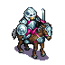

Die Schlacht um Wesnoth - Das Brettspiel
===================================

  
"Die Schlacht um Wesnoth" ist ein quelloffenes, rundenbasiertes Strategiespiel in einer Fantasywelt für den Computer. Dieses Projekt ist der Versuch, Wesnoth als klassisches Brettspiel verfügbar zu machen.

Rekrutiere deine Armee und erobere Dörfer für mehr Einkommen und lasse deine Einheiten auf einer Karte aus hexagonalen Feldern kämpfen! Platziere deine Einheiten auf strategisch günstigem Gelände, das gute Verteidigung bietet.

Wir haben versucht, das Spiel einfach und nah an Wesnoth's Kernprinzipien zu halten, damit es Spaß macht, ohne sich allzuviele Einheitenwerte merken zu müssen. Die einzigen Dinge, die nachgehalten werden müssen, sind deine Goldmenge, deine eroberten Dörfer sowie die Lebenspunkte deiner Einheiten. Das geschieht mit einfachen Markern und Büroklammern.

-----------------------------------------------

## Spielvorbereitung
* Druck das Spielmaterial aus (entweder direkt auf Kartonpapier oder klebe es später darauf):
  + `Einheiten-r.svg`: Vorderseite der Einheiten
  + `Einheiten-v.svg`: Rückseite der Einhieten
  + `Spielertafel.svg`: Übersichtstafel je Spieler mit allen Einheitenwerten, und um deinen Goldstand zu markieren.
  + Die Einheitenkärtchen haben nach dem Ausschneiden einen kleinen weißen Rand unten. Steck diesen in Plastikhalter, oder schneide ihn in der Mitte senkrecht ein; du kannst beide Teile dann (wechselseitig) auf eine Kartonunterlage aufkleben, damit ein Ständer entsteht.
  + Karte, auf der gespielt wird:
    - wir empehlen dir eine vorgefertigte Karte aus dem `maps/` Ordner auszudrucken. Diese kannst du direkt benutzen, oder du erweiterst sie mit den Kartenteilen, die du ausdruckst und auf Karton klebst (oder dir gleich ganz eigene Karten baust, s.u.):
    - `Kartenteile-1.svg`: Ein Set an Kartenteilen. Die Burgen sind als ein größeres Teil gemeint.
    - `Kartenteile-2.svg`: Noch mehr Teile :)
    - Speziell für diese Kartenteile ist es von Vorteil, wenn der Karton etwas stärker ist.
* Besorge dir einen *zehnseitigen Würfel* mit den Zahlen 0-9 (entweder eine App oder Onlinewürfel, oder einen echten).
* Besorge einige farbige Marker je Spielerfarbe (ca. 10, wir benutzen Fädelperlen):
  + einen Marker für die Goldleiste
  + mehrere für die eroberten Dörfer
* Du brauchst auch noch einige Büroklammern:
  + in der Spielerfarbe zum markieren deiner Einheiten (und gleichzeitig um dort die Lebenspunkte zu markieren)
  + eine andere Farbe zum markieren deines Königs (du kannst auch eine Fädelperle auf eine Büroklammer in der Spielerfarbe stecken)

## Spieldurchführung
Das Spiel wird abwechselnd Zug für Zug auf einer Karte mit hexagonalen Feldern gespielt. Einigt euch, wer beginnen darf; bei Revanche darf der vorherige Verlierer beginnen.
Der Zug eines Spielers endet, wenn der Spieler dies so sagt oder er keine weiteren durchführbaren Aktionen mehr hat.
Das Spiel ist sofort gewonnen, wenn der gegnerische König besiegt wurde, es ist sofort verloren, wenn der eigene König fällt.

### Ein neues Spiel starten
#### Eine gute Karte bauen
Als allererstes benötigt ihr eine gute Karte, auf der ihr spielen könnt. Vorzugsweise benutzt ihr eine der ausgewogenen vorgefertigten Karten, oder ihr baut selbst eine. Natürlich könnt ihr auch eine vorgefertigte Karte mit eigenen Teilen anpassen. Die Karte setzt sich aus hexagonalen Kartenfeldern zusammen. Schaut euch die Feldteile genau an, sie passen nur in einer Position gut (horizontale Kanten oben und unten, Spitzen mittig links und rechts). Am besten schaut ihr euch ein Dorffeld an, dort sieh man es am deutlichsten.

Eine gute Karte ist ausgeglichen und bevorzugt keinen Spieler. Das bedeutet, dass sie Gegenden haben sollte, die einfach zu verteidigen sind und andere, die man leicht einnehmen kann. Eine ausgewogene Zahl an Dörfern ist ebenfalls wichtig und die Dörfer sollten für beide Seiten in der gleichen Entfernung für beide Spieler sein. Bei den Dörfern sollten einige Felder mit guter Verteidigung (z.B. Wald) benachbart sein, damit sie leichter anzugreifen sind. Es ist auch in Ordnung, wenn etwas Wasser benachbart ist, aber Bunker, die schwer zu nehmen sind, sollten vermieden werden.

#### Startaufstellung
Leg die benötigten Spielmterialien bereit (Würfel, Einheiten, Büroklammern und Marker).
Jeder Spieler legt einen Marker auf die **25 Gold** Position auf der Spielertafel.
Jeder Spieler sucht sich eine Einheit aus dem Vorrat aus und markiert sie mit dem Königsmarker. Der König jedes Spielers wird dann auf sein Schloss-Feld gesetzt.

Du bist jetzt für deinen ersten Zug bereit.

### Der Ablauf eines Zuges
Jeder Zug folgt dem selben prinzipiellem Ablauf: *1. Einkommen erhalten* -> *2. Einheiten heilen* -> *3. Einheitenaktionen*.

#### Einkommen erhalten
Für jedes am Zugstart gehaltene Dorf erhältst du 2 Gold. Jede Einheit (außer dem König) kostet ein Gold Unterhalt. Aktualisiere deinen Goldmarker um das Ergebnis (welches auch negativ sein kann).  
*Beispiel:* Du hältst drei Dörfer und hast neben deinem König 4 Einheiten: Du bekommst 3x2=6 - 4; also plus zwei Gold.

#### Einheiten heilen
 Jede Einheit, die am Zugstart auf einem Dorf steht, darf jetzt einen Lebenspunkt heilen. Passe die Büroklammer auf der Einheit entsprechend an.

#### Einheitenaktionen
Nun kannst du für jede Einheit verschiedene Aktionen ausführen. Die Reihenfolge der Aktionen liegt in deinem Ermessen. Du kannst deinen Zug jederzeit beenden; auch wenn du noch keinerlei Einheitenaktion durchgeführt hast. Sobald du deinen Zug beenden möchtest, gib deinem Mitspieler deutlich Bescheid.

#### Rekrutieren
 Dein König kann weitere Einheiten rekrutieren, wenn er auf dem Schlossfeld (nicht Burgfeld!) steht und genug Gold für die gewünschte Einheit in deiner Schatztruhe liegt:

* Zieh den Kaufbetrag von deimem Goldvorrat ab und passe deinen Goldmarker entsprechend an. Dein Goldbetrag darf durch den Kauf nicht negativ werden.
* Suche dir deine gewünschte Einheit aus dem Einheitenvorrat aus.
* Nimm eine Büroklammer in deiner Farbe und markiere die "volle Leben"-Position auf der Einheitenkarte.
* Stelle die Einheit auf ein freies Burg-Feld, das mit dem Schlossfeld verbunden ist.

Frisch rekrutierte Einheiten haben keine Bewegungspunkte; du kannst in diesem Zug weder damit angreifen noch sie bewegen.

#### Einheiten bewegen
 Einheiten können sich grundsätzlich frei über das Schlachtfeld bewegen. Jede Einheit hat dazu eine festgelegte Anzahl an *Bewegunspunkten*. Um ein angrenzendes Feld zu betreten, muss die Einheit mit Bewegungspunkten "bezahlen". Die Kosten hängen von der jeweiligen Einheit und dem Geländetyp ab.  
Einheiten können beim Ziehen durch eigene Einheiten hindurchgehen, aber nicht auf dem gleichen Feld stehenbleiben.

***Kontrollzone***  
Jede Einheit hat eine *Kontrollzone* um ihr besetztes Feld herum: Wenn eine Einheit ein Feld angrenzend zu einem Feind betritt, verliert sie alle verbliebenen Bewegunspunkte. Dies erlaubt Einheiten, Gegenden auf der Karte für gegnerische Einheiten abzusperren und sogar, gegnerische Einheiten zu fangen, um sie an der Flucht zu hindern (platziere jeweils eine Einheit auf der gegenüberliegenden Seite und der Gegner hat keine unbewachten Felder mehr, auf die er ziehen kann).  
Die *Kontrollzone* der eigenen Einheiten geschickt einzusetzen kann ein deutlicher Siegfaktor sein.

***Dörfer einnehmen***  
Um ein Dorf einzunehmen, muss einfach eine Einheit darauf ziehen. Setze einen Marker auf das Dorf, so dass sichtbar ist, dass das Dorf nun dir gehört.
Die erobernde Einheit verliert alle Bewegungspunkte, wenn sie ein Dorf einnimmt, kann aber noch angrenzende Einheiten angreifen.
In deinem nächsten Zug wird dir das Dorf zwei Gold mehr Einkommen bescheren (sofern es dann noch dir gehört). Es ist eine gute Idee, deine Dörfer gut zu verteidigen!

#### Angreifen
  Eine Einheit kann einmalig pro Zug eine benachbarte Einheit angeifen. Sie verliert alle verbliebenen Bewegungspunkte, wenn sie angreift (bleibt also dort stehen).

1. Gib klar bekannt *welche Einheit* angreifen soll, *welche Einheit* angegiffen wird und *mit welcher Angriffsart* (Nah- oder Fernkampf) der Angriff geführt wird.
2. Schaut euch die Werte der beteiligten Einheiten an: Anzahl an Angriffen, verursachter Schaden sowie die Geländeverteidigungswerte für beide Einheiten.
3. Würfelt den Angriff aus:
 + Wenn der Würfel mindestens die Zahl der gegnerischen Geländeverteidigung beträgt, wurde ein Treffer erziehlt (ausgenommen der Magier, der stets trifft, wenn er 3 oder mehr würfelt).  
   -> Pass den Lebenspunktemarker (Büroklammer) der getroffenen Einheit entsprechend der Schadenshöhe an.
4. Die verteidigende Einheit führt nun einen Gegenschlag in der gleichen Weise aus (falls sie noch lebt und die Angriffsart hat). Dabei ist die Angriffsart diejenige, mit der der initiale Angriff geführt wurde (also Nahkampf, wenn mit Nahkampf angegriffen wurde, und Fernkampf, falls ein Fernkampfangriff stattfand). Falls die Einheit keine solche Angriffsart hat, tut sie nichts.
5. Falls deine Einheit einen weiteren Angriff für den gewählten Angriffstyp hat, führe ihn nun nach gleichem Ablauf aus.
6. Falls die gegnerische Einheit noch eine Verteidigung im gewählten Typ hat, dann kann sie nochmal nach gleichem Muster verteidigen, usw.

Wenn die Lebenspunkte einer Einheit auf Null (oder weniger) fallen, wird sie sofort aus dem Spiel genommen und zurück in den Vorrat gelegt. Sollten Angriffe/Verteidigungen übrig gewesen sein, verfallen diese.
Sobald der Angriff vorbei ist, hat die angreifende Einheit keine Bewegungspunkte mehr und kann auch nicht nochmal angreifen. Sie kann sich jedoch noch beliebig oft wie eben dargelegt verteidigen, sollte sie selbst angegriffen werden.

*Beispiel 1*: Ein Magier geht auf das Waldfeld neben einem Kämpfer in einer Burg und greift ihn an. Er hat vier Fernkampfangriffe; der Kämpfer kann einmal versuchen, den Magier zu treffen, da er ebenfalls einen Fernkampfangriff hat. Der Magier fängt an und würfelt eine 3 - Treffer (der Magier braucht stets nur eine 3 oder mehr zu würfeln)! Der Kämpfer verliert einen Lebenspunkt. Jetzt wehrt sich der Kämpfer: er würfelt eine 4! Der Magier steht jedoch auf Wald und der Kämpfer hätte daher eine 5 benötigt um den Magier zu treffen. Dieser bleibt somit unverletzt. Jezt ist wieder der Magier an der Reihe und würfelt eine 4! Wieder ein Treffer! Der Kämpfer hat keine Fernkampfangriffe mehr übrig und kann sich daher nicht mehr wehren. Der Magier würfelt gleich nochmal: 2, kein Treffer. Sein letzter Wurf ist eine 8 und trifft daher.  

*Beispiel 2:* Nach dem Kampf hat der Kämpfer noch zwei Lebenspunkte und entscheidet, den Magier anzugreifen, da er keinen Nahkampfangriff hat und sich somit nicht wehren kann. Er würfelt eine 5 und erziehlt einen Treffer (der Magier hat im Wald 5 Verteidigung). Jetzt kann der Magier, wie bereits gesagt, nicht zurückschlagen, daher würfelt der Kämpfer gleich nochmal: 6, Treffer! Der Magier verbleibt mit einem Lebenspunkt.  

*Beispiel 3:* Die Situation ist jetzt sehr riskant: Wenn der Magier angeift, geht er das Risiko ein, dass der Gegenangriff des Kriegers trifft, und dieser weitere Schadenspunkt reicht aus, den Magier aus dem Spiel zu nehmen, was sehr kostspielig wäre (der Magier kostet 7 Gold, während der Krieger mit 5 recht günstig ist). Der Krieger bräuchte dafür eine 5 oder mehr, hat also eine 50% Chance. Auf der anderen Seite hat der Magier eine hohe Chance, den Krieger aus dem Spiel zu nehmen, sollte Letzterer verfehlen: der Magier braucht nur zwei seiner vier Angriffe treffen und hat je Versuch eine 70% Trefferchance (trifft also im Durchschnitt fast 3 von 4), man kann den Erfolg der Aktion in dem Fall also als relativ sicher annehmen.  
Der Magier entscheidet sich für Angriff und würfelt: eine zwei, verfehlt! Der Krieger verteidigt sich mit einer 6 - Treffer, der unglückliche Magier verliert dadurch seinen letzten Lebenspunkt und wird sofort aus dem Spiel genommen. Seine verbliebenen drei Angriffe verfallen.

## Die Einheiten
| Einheit                                                                                          | Beschreibung                                                                                                                                                                                                                                                                                                                                                                                                                                                                                                                                                                                                                                                                                                                                                                             |
|-----------------------------------------------------------------------------------------------|--------------------------------------------------------------------------------------------------------------------------------------------------------------------------------------------------------------------------------------------------------------------------------------------------------------------------------------------------------------------------------------------------------------------------------------------------------------------------------------------------------------------------------------------------------------------------------------------------------------------------------------------------------------------------------------------------------------------------------------------------------------------------------------------------------------------------------------------------------------------------------------------------------------------------------------------------------------------------------------------------------------------------------------------------------------------------------------------------------------------------|
|                                                 |**Der Magier** ist die einzige Einheit, die die Möglichkeit hat, gesunde gegnerische Kavallerie, Kämpfer und Schützen in einem Zug auszuschalten. Sie ist speziell gut geeignet, Kavallerie und schwere Infanteristen anzugreifen, weil diese keinen Fernkampfangriff haben. Ihr Hauptvorteil ist der **magische Angriff**, der stets eine 70% Trefferwahrscheinlichkeit hat (nur 3 oder besser würfeln, um zu treffen) und somit das Gelände des Gegners ignoriert, was sie sehr geeignet macht, befestigte Stellungen anzugreifen. Allerdings ist sie auch sehr verwundbar und nimmt beim Angriff auf einen Kämpfer oder Schützen vermutlich Schaden; speziell, da sie keinen Nahkampfangriff hat und somit im Folgezug ungestraft angegriffen werden kann. Das setzt ihr recht teures Leben aufs Spiel.                                                                                                                                                                                                                                                                                                                                                                                                                                                                                                                                                                                                         |
||                                                                                                                                                                                                                                                                                                                                                                                                                                                                                                                    **Der Kämpfer** ist eine ausgewogene günstige Einheit mit Fokus auf Nahkampf und normalerweise der Hauptanteil deiner Armee. Er ist die effizienteste Einheit, Magier anzugreifen.                                                                                                                                                                                                                                                                                                                                                                                                                                                                                                                                                                                                                                                                                                                                                                                                                                                                                                                                                                                                                                                                                                                                                                                                                                                                                                                                                                                                                                                                                                                                                                                                                                                                                                                                                                                                                             
|                                       |                                                                                                                                                                                                                                                                                                                                                                                                                                                                                                                                                                                                    **Der Schütze** ist ebenfalls ausgewogen, aber spezialisiert auf Fernkampf; außerdem hat er die beste Verteidigung im Wald. Durch seinen Fernkampfangriff ist er gut geeignet, gegen gegnerische Magier zu verteidigen.                                                                                                                                                                                                                                                                                                                                                                                                   
|                                     |                                                                                                                                                                                                                                                                                                                                                                                                                                                                                                                                                                                                                                                                                                                     **Schwere Infanterie**  ist teuer und langsam, hat aber viele Lebenspunkte. Obwohl er leichter zu treffen ist, braucht man mindestens drei Krieger, um ihn in einer Runde zu Fall zu bringen, wobei sie heftigen Gegenschaden zu erwaten haben, wenn sie Nahkampf nutzen. Schwere Infanterie ist gut geeignet, Gegenden zu blockieren und zu halten, speziell wenn er in Burgen oder Dörfern steht. Die Magierin ist sein größter Feind und eine große Gefahr.                                                                                                                                                                                                            
||                                                                                                                                                                                                                                                                                                                                                                                                                                                                                                                                                                                                                                                                                                                                                                                                                                                                                                                                                                                                                                                                                                             **Kavallerie** ist schnell, aber keine gute Kampfeinheit und hat fast überall schlechte Verteidigung. Sie kann allerdings schnell Schlüsselgelände und entfernte Dörfer einnehmen, was ein Vorteil sein kann. Stelle sicher, dass sie zügig Verstärkung erhalten kann, wenn du sie vorschickst, da sie das Gelände üblicherweise nicht lange halten kann.

Anhang
========

## Designentscheidungen
Wesnoth ist ein sehr komplexes Spiel, das viele Fraktionen, Einheitentypen und verschiedene Gelände sowie Einheitenmodifikatoren enthält. Manchmal ändern sie den Spielverlauf drastisch. Allerdings sind diese erweiterten Spielmechaniken schwer zu tracken und umständlich zu berechnen. Es müssten für jede Einheit weitere Dinge wie Erfahrung, verschiedene Level usw. nachgehalten werden. Das wäre für ein einfaches Brettspiel nicht sehr lustig.

Mein Sohn und ich haben daher versucht, die fundamentalen Kerneigenschaften von Wesnoth zu nehmen und das sind in unseren Augen die hexagonalen Kartenfelder, Schere-Stein-Papier Spielstil und dass das Gelände die Wahrscheinlichkeit eines Treffers bestimmt, was die Überlebenswahrscheinlichkeit der Einheit stark definiert und damit Taktiken und strategisches Vorgehen wichtig wird.  
Aus diesem Grund haben wir uns bewusst dagegen entschieden, viele verschiedene Einheiten einzubauen, oder Erfahrungslevel und Levelaufsteig, genauso wie viele veschiedene Geländetypen oder den Einfluß von Tag-/Nachtzyklen.

Nachdem jeder Spieler die gleichen Einheiten hat, ist auf einer fairen Karte niemand im Vorteil.

## Lizenz und Danksagung
Das Originalmaterial wurde unter der GPLv2 lizensiert, und so ist es auch dieses Spiel. Wir möchten den Machern von Wesnoth sehr dafür danken, so ein schönes Spiel erstellt zu haben, und auch speziell den Grafikdesignern dafür, dass sie durch Ihre Arbeit die Grundlage dafür gelegt haben, dass dieses Brettspiel deutlich einfacher zu Entwickeln war.
