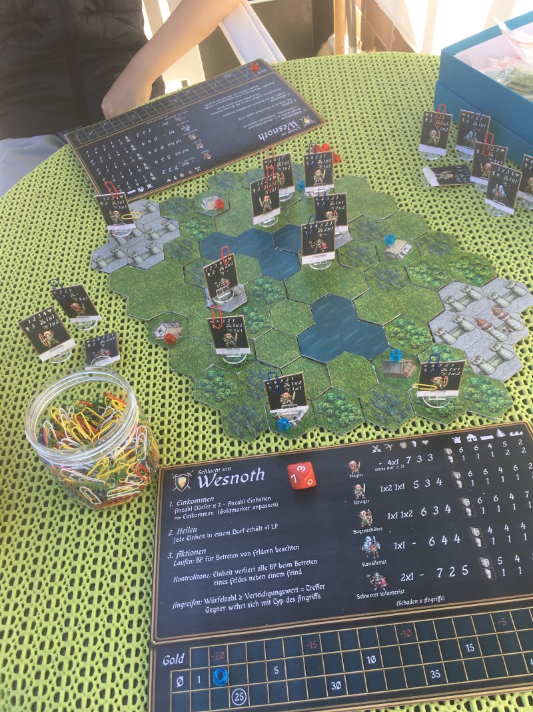
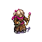
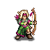
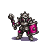
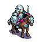

The Battle for Wesnoth - Board Game
===================================

The Battle for Wesnoth is an open source, turn-based strategy game with a high fantasy theme. Originally a complex computer game this project is an attempt to make it available as a classical board game.

Recruit your army, conquer villages for income on the hextiled map and let your units fight! Place your units strategically on terrain providing good defence.

We tried to keep it simple and to the core gameplay, so it will actally be fun without tracking all the stats. The only thing to track is your gold and each units hitpoints.

-----------------------------------------------

## Prepare playing
* Print out the source material (either on thick paper or glue it to cardboard afterwards):
  + `Einheiten-r.svg`: front side of units
  + `Einheiten-v.svg`: back side of units
  + `Kartenteile-1.svg`: A set of tiles. The castles are supposed to be one big tile.
  + `Kartenteile-2.svg`: even more tiles!
  + `Spielertafel.svg`: table for players showing all unit stats and also a panel to track gold.
  + Especially for the hex tiles it is good if the cardboard is a little thicker.
  + The units have some white space below them. You can either place them into plastic slots or cut the white in the middle and glue it down to a piece of cardboard.
* Get a *ten sided dice* marked 0-9 (either an online dice or buy a physically one).
* Get some small markers in players colours
  + one for the gold panel
  + several to mark conquered villages
* Get some paper-clips:
  + in players colour to mark units side and track units hitpoints
  + one other colored paper-clip per player to mark the king unit

## Playing the game
The game is played turn by turn on a hextiled map. Choose who begins, for rematch the looser should start.  
A turn ends when the player announces so or has no performable actions left.  
The game is won immediately when you finish the enemy king, or lost if your king got finished.

### Setup a new game
#### Building a good map
You first need a map to play on. The map is built from the hex tiles. Look at them closely, there is only on position they link nicely (horizontally edges north and south, points west and east); refer to the village or castle tiles where this can be seen best.

A good map is balanced and does not favor a specific side. It should have some areas which are easy to defend and others easy to conquer. Make a fair ammount of villages and place them so, that the movepoints to conquer them are the same for both players. When placing villages, make some hexes with good defense values (woodland) around. It's okay to also have water adjacent, but avoid bunkers that are not attackable anymore.  

#### Starting setup
Prepare the game materials (dice, the units, the paper-clips, the markers).  
Place a marker on your gold panel at **25 gold**.  
Select your king unit, mark him with the king paper-clip and place him on the castle hex tile.

You are now ready for the first turn.

### A turn explained
Each turn follows the same principle flow: *Get income*, *Heal units*, *unit actions*.

#### Get income
You get 2 Gold per hold village. Subtract the count of your normal units (the king is free). Adjust your gold marker for the ammount (which may be negative).

#### Heal units

Now each unit staying at a village heals one hitpoint. Adjust the paper-clips accordingly.

#### Unit actions
Now you can choose amongst several different actions. You can end you turn at any point, including a complete pass if you feel everything is still fine. Once you are done, announce it to you opponent.

#### Recruiting

You may recruit units if you have the necessary positive gold ammount:

* Subtract the gold ammount and update your gold marker
* You can choose a new unit from the pool
* Pick a paper-clip in your colour and mark the units full-hitpoints position
* Place the unit to your chosen castle hex

Freshly recruited units have zero movepoints; you can move them only in your next turn.

#### Moving units

Units can move freely across the battlefield. Each unit has a fixed ammount of *move points*. To enter the next hex field, a unit has to "pay" with these movepoints. The "cost" is depending on the terrain type and the unit in question.

*** Zone of control ***  
Each unit has a *zone of control* around it. If your unit enters the hex field adjacent to an enemy unit, it looses all emaining movepoints for the current turn. This allows units to block off access to areas on the battlefield and even to capture enemy units so they can't flee. Employing *zone of control* can be a significant factor in winning a game.

#### Attacking
 
A unit may attack any adjacent enemy unit. You can attack only once with a given unit and it looses all remaining move-points by doing so.

1. Announce clearly *what unit* will attack *which other unit* and the used *attack type*.
2. Look at the units stats involved to get the number of attacks, damage dealt and terrain defense values for both units.
3. Roll the dice for your attack.
  + If the dice shows at least the number of the opposing units terrain defense, you scored a hit (except the mage who always will only need 3 or more).  
    -> Adjust the hitpoints of the enemy unit according to the damage of the attack.
4. The defending unit now makes a counterattack in the same way just described. it uses melee if the initial attack was melee or ranged if it was ranged. If the unit has no such attack, it will do nothing.
5. If your unit has another attack left, perform it now.
6. If the opposing unit has another defence left, it will be performed now. This is even true, if you had no attack left (like a 1x1 attacking a 1x2 unit).

If hitpoints of any unit drops to zero, the unit is imediately removed from the battlefield and put into the units pool. Any attacks still left are discarded.  
Once the attack is over, the attacking unit has no movepoints left and is done for this turn. note that it can still defend itself any time it is attacked like outlined obove.

## The units
| Unit                                                                                          | Description                                                                                                                                                                                                                                                                                                                                                                                                                                                                                                                                                                                                                                                                                                                                                                             |
|-----------------------------------------------------------------------------------------------|--------------------------------------------------------------------------------------------------------------------------------------------------------------------------------------------------------------------------------------------------------------------------------------------------------------------------------------------------------------------------------------------------------------------------------------------------------------------------------------------------------------------------------------------------------------------------------------------------------------------------------------------------------------------------------------------------------------------------------------------------------------------------------------------------------------------------------------------------------------------------------------------------------------------------------------------------------------------------------------------------------------------------------------------------------------------------------------------------------------------------|
|                                                 |**The mage** is the only unit in the game that has the potential to kill full healthy cavalry, fighters and archers in one turn. It is also well suited to attack cavalry and heavy infantry since they lack ranged counterattacks. Its main advantage is that **the magical attack always has a 70% chance of hit (throw at least 3 to score a hit)** and thus ignores the opponents terrain defence. But it is also very fragile, and as it will probably take at least one hit from a fighter, it is dangerous to attack; especially because it is expensive and has no meele counterattack.                                                                                                                                                                                                                                                                                                                                                                                                                                                                                                                                                                                                            | |                                                                                                                                                                                                                                                                                                                                                                                                                                                                                                                    **The fighter** is a well rounded cheap unit focused on melee and is usually the meat of your army. It is the most efficient unit to kill mages.                                                                                                                                                                                                                                                                                                                                                                                                                                                                                                                                                                                                                                                                                                                                                                                                                                                                                                                                                                                                                                                                                                                                                                                                                                                                                                                                                                                                                                                                                                                                                                                                                                                                                                                                                                                                                                 
|                                       |                                                                                                                                                                                                                                                                                                                                                                                                                                                                                                                                                                                                    **The archer** is also well rounded but slightly better in forest. As it is focused on ranged attacks, it is also the best unit to defend aginst mages.                                                                                                                                                                                                                                                                                                                                                                                                   
|                                     |                                                                                                                                                                                                                                                                                                                                                                                                                                                                                                                                                                                                                                                                                                                     **Heavy Infantry**  is expensive but has huge hitpoint ammounts. However it is more easy to hit, you need at least three fighters or archers to kill one heavy infantry with confidence, where the fighters will take hevy retailiation when using melee. It is a good choice to block off and hold areas, especially if he has good ground or a village. The mage is the HI's nightmare.                                                                                                                                                                                                                 
||                                                                                                                                                                                                                                                                                                                                                                                                                                                                                                                                                                                                                                                                                                                                                                                                                                                                                                                                                                                                                                                                                                             **Cavalry** is no good fighting unit and has bad defence everywhere. It may be advantageous to grab villages or key terrain early, but be sure to reinforce as it will not be able to hold ground for long usually.|

Appendix
========

## Design decision background
Wesnoth is a fairly complex game involving lots of factions with lots of units with lots of different unit traits and an experience system that levells units, sometimes changing the unit drastically. However, that all involves many calculations that are cumbersome, and not fun in a classical board game.

My son and i tried to strip down the game to its fundamental core features, and in our eyes this is the hex-tiled map, rock-scissors-paper playstyle and the terrain defence as main factor for units survivability.  
So we deliberately did not include tracking experience and levelling, many units, some diverse terrain and unit traits.

As each player has the same unit types, the game should be fairly balanced (aside from the chosen map).

## License and credits
The original material was licensed as GPLv2, and so is this game. I really want to thank all the wesnoth developers for making such a wonderful game and especially the graphics designers for providing the foundation to make making this board game easy.
